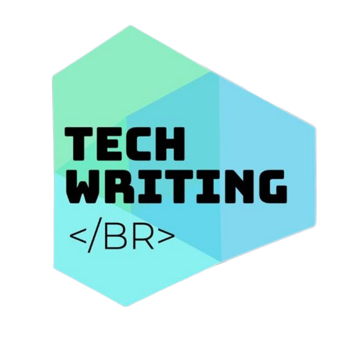
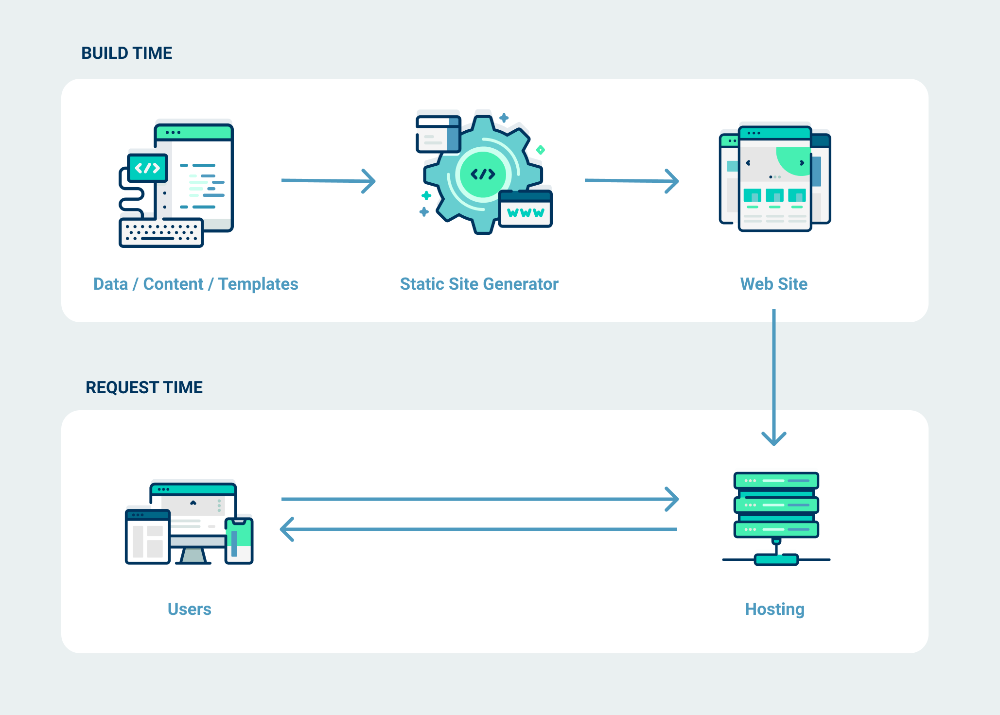
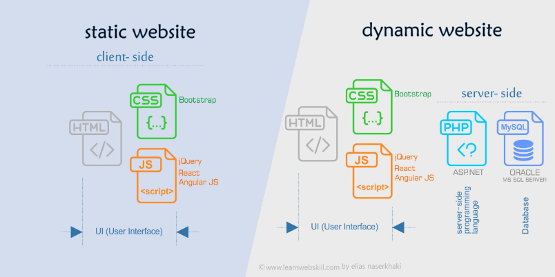
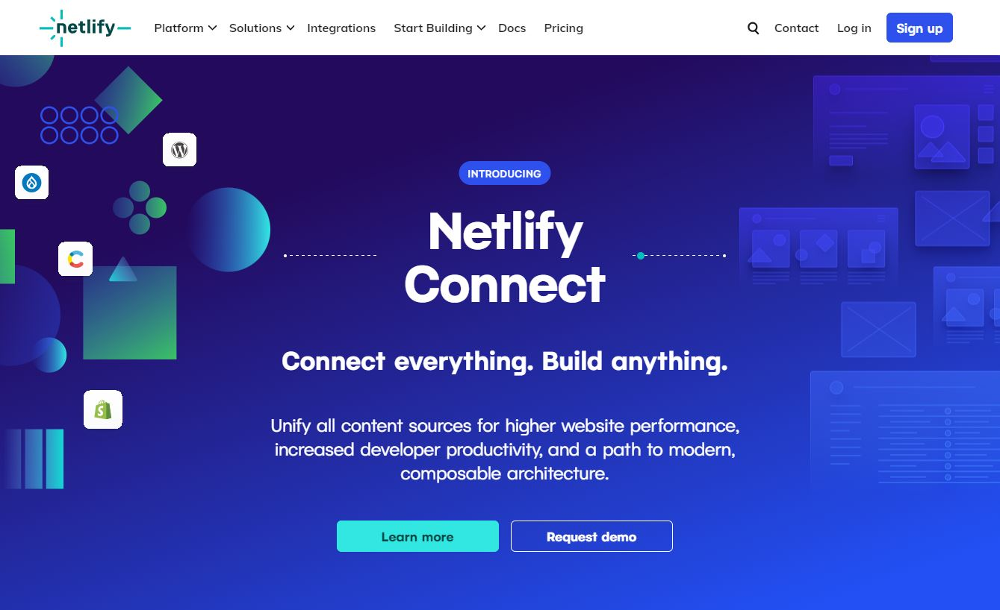
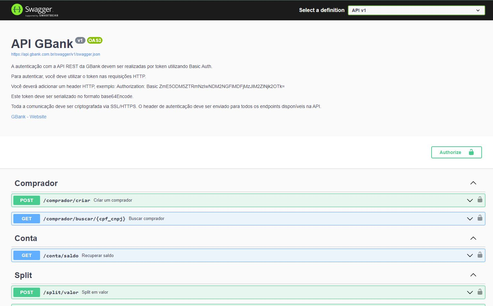

<!-- _class: lead invert-->

# **Technical Writer Portfolio** <!--fit-->

## Um pequeno guia para criar o `SEU LUGAR` na internet. <!--fit-->

---

# Bio

**Gliver Couto**

- Technical Writer na CWI Software (Banco BV).
- Foco em documentação de APIs e content writing.
- Background em automação, eletrônica e programação.
- Entusiasta de Front-end e UI Design.

---

# `Portfolio` : a importância

Ter um portfolio é a forma mais efetiva de evidenciar seu **SkillSet**, através dele você pode:

- Demonstrar suas habilidades como technical writer com exemplos de projetos reais, contribuições e impacto do seu trabalho.
- Destacar as ferramentas de trabalho que você tem domínio.
- Transmitir mais credibilidade e profissionalismo.
- Apresentar seu background educacional.

---

# `Conteúdo`: não deixe de fora

É importante estar no seu portfolio:

- Technical Writing Samples - Projetos.
- Biografia Profissional - skills.
- Meios de contato.
- Currículo - LinkedIn link.

---

# `Portfolio benchmark`: exemplos

Roube como um artista!

- https://swapnilogale.github.io/
- https://www.djw.fyi/
- https://wellshapedwords.com/
- https://www.straygoat.co.uk/
- https://glivercouto.github.io/

---

# `Como criar`: soluções

- Gerador de Sites estáticos (suporte Markdown).
- Hospedar com custo zero.
  - GitHub Pages.
  - Netlify.

---

## `Sites estáticos`

- Porquê usar:

  - Curva de aprendizagem rápida.
  - Mesmas tecnologias usadas em CMS.
  - Majoritariamente HTML e CSS.
  - Uso de Markdown.

- Pré-requisitos:
  - Exige conhecimento básico de GIT.
  - Familiaridade básica com linhas de comando.

---

---

## `Sites Estáticos` vs `Sites Dinâmicos`

---

## `Sites estáticos`: soluções

Open source:
https://jamstackthemes.dev/

Sugestões gratuítas:

- https://jamstackthemes.dev/demo/theme/portfolyou/
- https://jamstackthemes.dev/demo/theme/gradfolio/
- https://jamstackthemes.dev/demo/theme/jekyll-mr-green/
- https://github.com/stackrole/gatsby-starter-foundation

---

Sugestões pagas:

- https://blackcurrant.jekyll-themes.com/ ($9 dólares)
- https://jamstackthemes.dev/demo/theme/jekyll-hydejack-theme/ ($19 dólares)

---

## `Hospedagem`: custo ZERO

- GitHub Pages.

[Video passo-a-passo: Jekyll Mr Green theme](https://www.youtube.com/watch?v=U7ryXlWI1mY)

---

## `Hospedagem`: custo ZERO

- [Netlify](https://github.com/stackrole/gatsby-starter-foundation#editing-content-and-adding-posts) .

---

# `Portfolio Challenge`: mão na massa!

- Como criar samples sem experiência?
- E se minha empresa não permite divulgar documentações internas?
- Como adquirir experiência com documentações de APIs?

---

- **How to YouTube videos.**

---

- **Falar sobre o projeto:**
  - [Swapnil Ogale](https://swapnilogale.github.io/)
    - Contexto.
    - Problema.
    - Contribuição.
    - Impacto.
- **Suprir informações sensíveis.**
  - [Daryl White ](https://www.djw.fyi/portfolio/business-requirements/#table-of-contents)

---

- **Reformular documentações de API:**
  - Pesquise especificações de APIs na internet.
    - Use palavras chaves, **ex**: **Swagger** + **bank**.
    - Melhore a especificação (openapi).
    - Use ferramentas Open Source para as documentações conceituais/Guides:
      - [MKDocs](https://squidfunk.github.io/mkdocs-material/).
      - [Docusauros](https://docusaurus.io/).
    - Use ferramentas Open Source para API Reference:
      - [Redocly](https://redocly.com/).

---

- **OpenAPI Specification (Swagger):**

.

---

# `Contato`: como me encontrar

- [**LinkedIn**](www.linkedin.com/in/gliver)
- https://glivercouto.github.io/
- Telegram da comunidade.
- Gostou do material?
  - Deixe uma recomendação no LinkedIn.

 

Obrigado!

